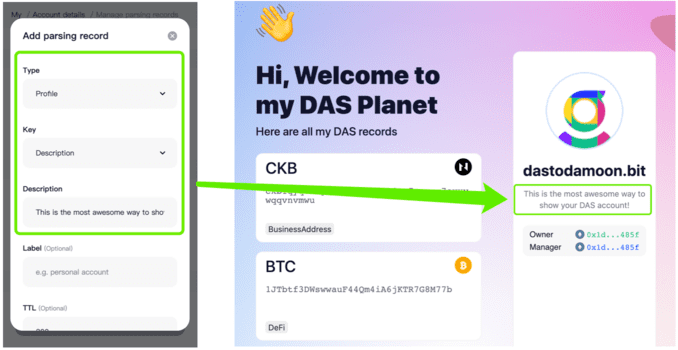

# bit.cc

[bit.cc](https://bit.cc) 是一个用于个性化展示 [DAS](https://da.systems) 账户的服务。

bit.cc 会将链上存储的 DAS 记录，以更加个性化的设计风格进行展示。随着用户设置的记录的内容的不同，将会有不同的展示形态。

如果你想快速将自己的所有社交联系方式/区块链地址/其他个性化信息向其他用户展示，就快设置你的 DAS 记录并分享对应的 bit.cc 地址吧！

## 使用方式

### 设置记录
所有在 DAS 设置的解析记录，都会反映在 bit.cc 上。

如果你还不知道怎么设置 DAS 的解析记录，可以查看下面的链接了解。

[如何设置 DAS 解析记录](https://mp.weixin.qq.com/s/9LWZES3CxyQGTPP3t0AJPA)

### 网页跳转
如果设置的记录是一个网页链接，或者记录本身可以跳转到一个网页，你可以直接跳转到对应的链接。

### 改变 bit.cc 展示
除了展示 DAS 解析记录之外，你还可以通过设置解析记录来改变 bit.cc 的展示。

#### 设置主题（theme）
bit.cc 默认主题是亮色模式（light）。

你可以通过设置自定义记录（`custom_key`）的 `bitcc_theme` 记录来改变 bit.cc 的主题。

现在 bit.cc 支持 `light`/`dark` 两个不同的主题。

#### 设置描述
通过设置资料记录（`profile`）分类下的的 `description` 的记录，可以改变 bit.cc 的个人描述。

## 分享链接
设置好 DAS 解析记录之后，就可以将你的 bit.cc 个性化页面分享给其他人了。

其访问链接格式如下：

> [yourname].bit.cc

比如你的账号是 dastodamoon，那么你的访问链接就是 [https://dastodamoon.bit.host](https://dastodamoon.bit.host) 或者 [https://dastodamoon.bit.cc](https://dastodamoon.bit.cc)。

