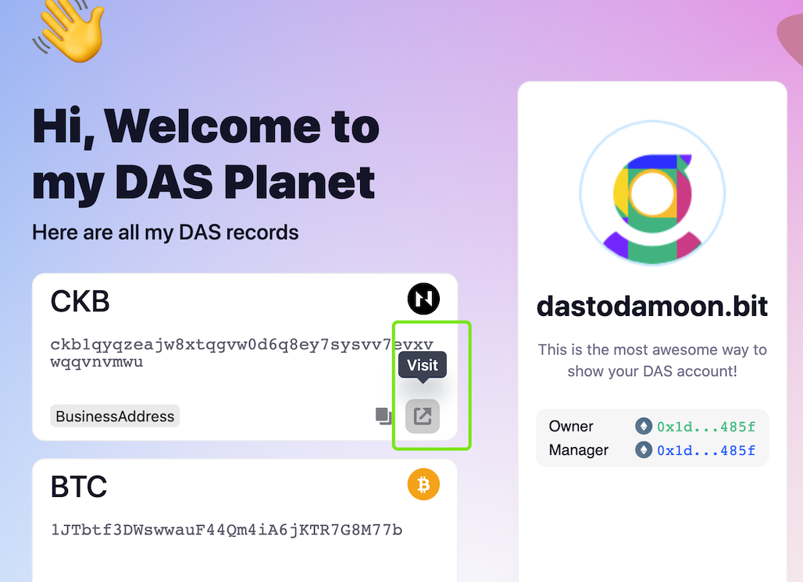
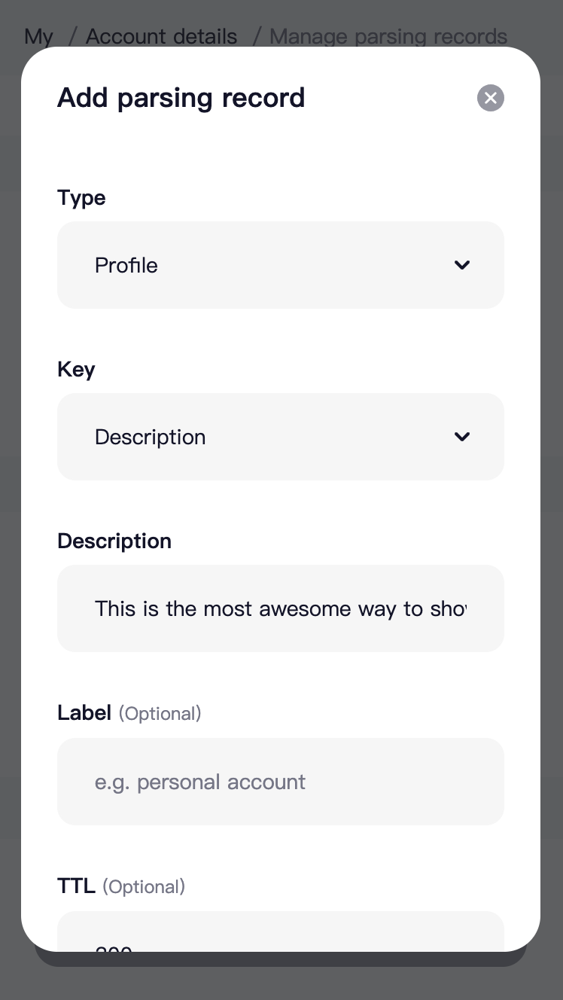
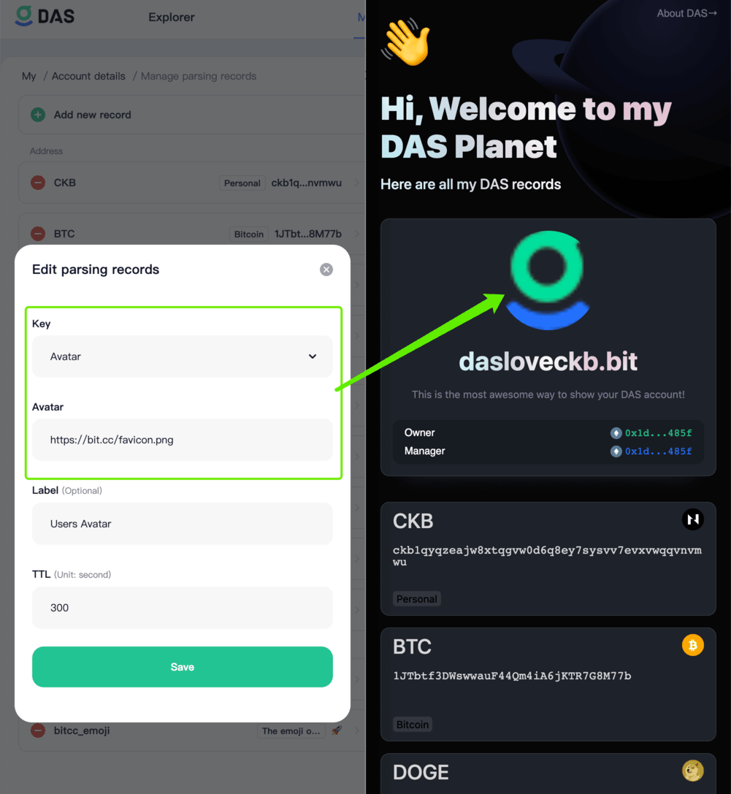
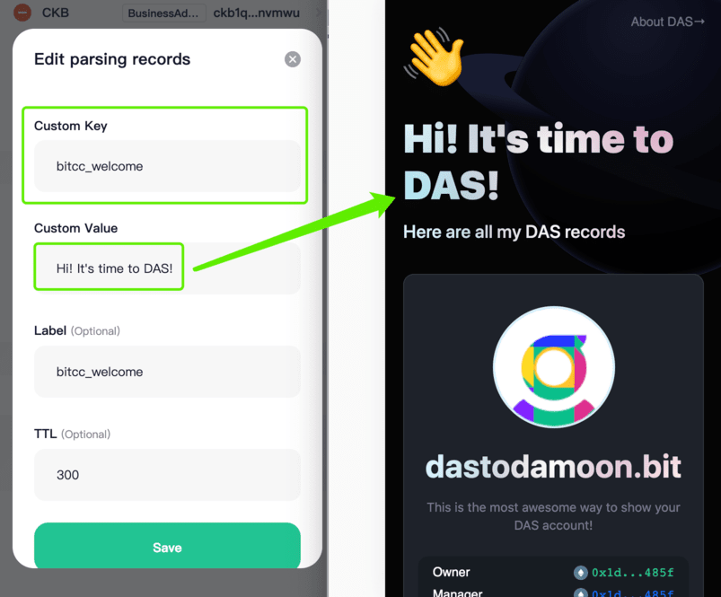
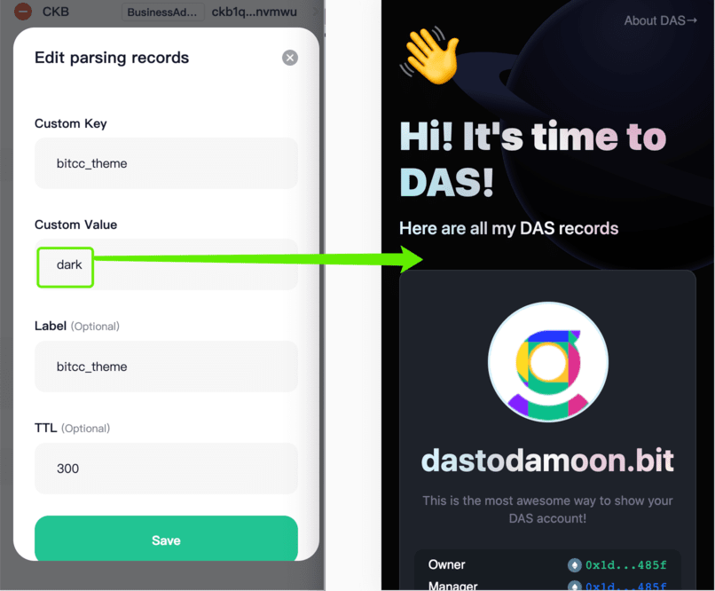
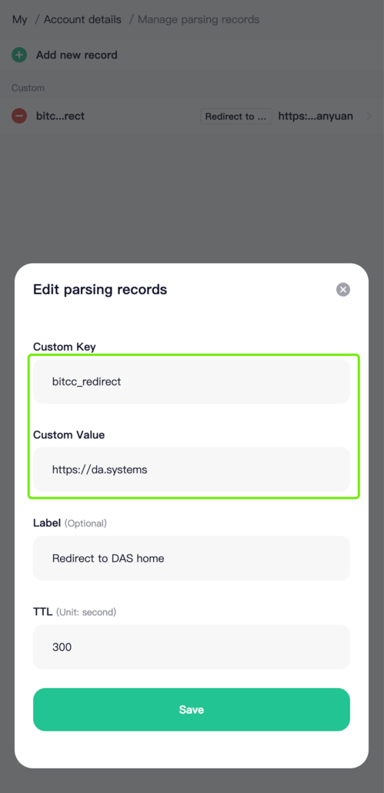

# bit.cc

简体中文 | [English](./README.md)

[bit.cc](https://bit.cc) 是一个用于个性化展示 [.bit](https://did.id) 账户的服务。

bit.cc 会将链上存储的 .bit 记录，以更加个性化的设计风格进行展示。随着用户设置的记录的内容的不同，将会有不同的展示形态。

如果你想快速将自己的所有社交联系方式/区块链地址/其他个性化信息向其他用户展示，就快设置你的 .bit 记录并分享对应的 bit.cc 地址吧！

## 使用方式

### 设置记录
所有在 .bit 设置的解析记录，都会反映在 bit.cc 上。

如果你还不知道怎么设置 .bit 的解析记录，可以查看下面的链接了解。

[如何设置 .bit 解析记录](https://mp.weixin.qq.com/s/9LWZES3CxyQGTPP3t0AJPA)

### 网页跳转
如果设置的记录是一个网页链接，或者记录本身可以跳转到一个网页，你可以直接跳转到对应的链接。

### 改变 bit.cc 展示
除了展示 .bit 解析记录之外，你还可以通过设置解析记录来改变 bit.cc 的展示。

#### 设置描述
通过设置资料记录（`profile`）分类下的 `description` 的记录，可以改变 bit.cc 的个人描述。

#### 设置头像
通过设置 `profile` 分类下的 `avatar` 字段，你可以改变 bit.cc 上展示的头像。

#### ~~设置欢迎语~~
> 欢迎语字段暂时不再生效。

你可以通过设置自定义记录（`custom_key`)，记录来改变 bit.cc 的欢迎语。

设置键（key）为 `bitcc_welcome`，取值可以为任何你想设置的文案。

#### 设置主题（theme）
你可以通过设置自定义记录（`custom_key`）记录来改变 bit.cc 的主题。

设置键（key）为 `bitcc_theme`，取值可以为`light`/`dark`，分别对应亮色/暗色两个不同的主题。默认是 `light`。

#### 设置重定向
你可以利用 bit.cc 作为你的其他网站的入口。当用户进入你的 bit.cc 页面之后，他们会被重定向到你指定的其他网页。

请设置自定义记录的键为 `bitcc_redirect`，其值可以是任何你想要的网站链接。

## 分享链接
设置好 .bit 解析记录之后，就可以将你的 bit.cc 个性化页面分享给其他人了。

其访问链接格式如下：

> [yourname].bit.cc

比如你的账号是 `dastodamoon.bit`，那么你的访问链接就是 [https://dastodamoon.bit.host](https://dastodamoon.bit.host) 或者 [https://dastodamoon.bit.cc](https://dastodamoon.bit.cc)。

